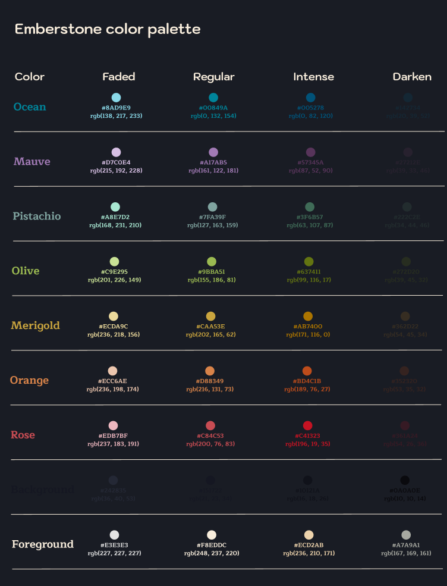

<h1 align="center">
	
     
	Emberstone palette
</h1>

**Welcome to Emberstone!**  
A cohesive collection of visual themes designed for the tools you use every day.

A vibrant, dark theme with warm accents to boost focus. Designed for those seeking a solid, lively environment that’s easy on the eyes.

## Preview

## 🎨 Color palette

You can access to the Figma version, always up to date : [figma palette](https://www.figma.com/design/MVqAtxFct344uUigFxsbya/Emberstonbe-Theme-research?node-id=0-1&t=Ud7ZHjzNFhPdlMNp-1).

## 💬 Contributing

We welcome contributions! Whether it's reporting a bug, requesting a new feature, or directly improving the themes, your input helps shape Emberstone.

## 📢 Feedback & Support

Found a bug? Have a feature request? Head over to each project issue page to let us know.

## 📜 License

Emberstone is open-source and available under the MIT License.
